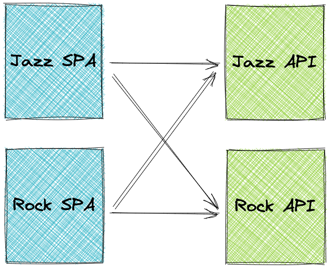

# Clerk-SSO-Starter

This is a starter repository about how to use [Clerk.dev](https://clerk.dev) to enforce SSO across multiple SPAs and APIs.

## Architecture



The repo contains two [ExpressJS](https://expressjs.com/) APIs and two SPAs bootstrapped with [CRA](https://reactjs.org/docs/create-a-new-react-app.html). Each SPA is using both APIs to fetch data.

## Start the APIs

```bash
cd backend

npm i

npm run start:jazz
npm run start:rock
```

## Start the SPAs

### Jazz SPA

```bash
cd frontend/jazz

npm i

npm start
```

### Rock SPA

```bash
cd frontend/rock

npm i

npm start
```

## SSO & SLO

1. Go to localhost:3000 (Jazz SPA)
2. Sign up or sign in with a user
3. Notice that both API requests are authenticated
4. Go to localhost:3001 (Rock SPA)
5. Notice that you are automatically signed in with the user from step 2
6. Sign out
7. Notice that both SPAs sign out (SLO)
